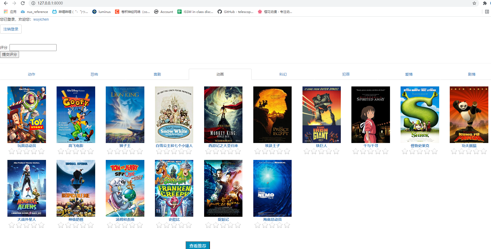
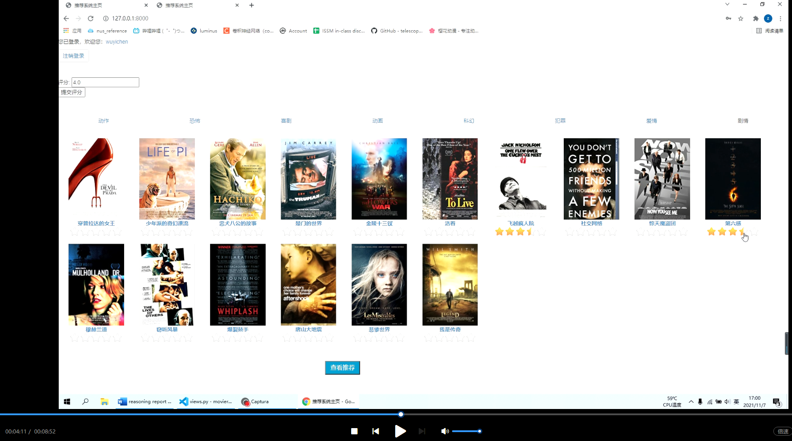

### [ Practice Module ] IRS-PM-2021-09-01-ISY5001-GRP-GGWP team-Movie Recommendation System

---

### <<<<<<<<<<<<<<<<<<<< Start of Project >>>>>>>>>>>>>>>>>>>>

---

## SECTION 1 : Movie Recommendation System
## Singapore Housing & Deveoplment Board - BTO Recommender System

---

## SECTION 2 : EXECUTIVE SUMMARY 
Due to the Internet has the characteristics of open information exchange, bidirectionality of information transmission, and extensive information coverage, the amount of information in the network expands and increases exponentially, and the problem of information overload and information trek on the network is becoming more and more serious.

Solving these problems, the key is to transform the Internet from passively accepting the requests of viewers to actively perceiving the information needs of viewers, and to realize the active information service of the network system to the viewers. In order to provide people with satisfactory information and services, the recommendation technology has emerged as the times require. 

---

## SECTION 3 : CREDITS / PROJECT CONTRIBUTION

| Official Full Name  | Student ID (MTech Applicable)  | Work Items (Who Did What) | Email (Optional) |
| :------------ |:---------------:| :-----| :-----|
| Wu Yichen(leader) | A0231544M | 1. Web UI designer 2. Model designer | e0703576@u.nus.edu |
| Zeng Zijing | A0231548E | 1. Database designer  2. Model designer | zengzijing1@163.com |

---

## SECTION 4 : VIDEO OF SYSTEM MODELLING & USE CASE DEMO

Note: Refer to project report at Github Folder: Video

---

## SECTION 5 : USER GUIDE

### [ 1 ] Install project dependencies:

> **In order to ensure the stable operation of the system, the following dependencies are all used stable versions.**
>
> **(1) Python 3.6+**
>
> **(2) Django 1.11**
>
> **(3) MySQL 5.6**

### [ 2 ] Build Database:
> **(1) Create a database in MySQL and give it a name, such as `MovieData`, and create a table `moviegenre3` in this database:**
>
> #### CREATE TABLE moviegenre3(imdbId INT NOT NULL PRIMARY KEY,title varchar(300),poster varchar(600));
>
> **(2)Import the table with the same name in the folder ‘data’ into the database table `moviegenre3` and run the command**:
>
> ####  **python manage.py migrate**
>
> **to build all related tables, and then import the ‘users_resulttable’ data in the folder ‘data’ into the table with the same name in the database.**

### [ 3 ] Operating System:

> **In order to ensure the stable operation of the system, the following dependencies are all used stable versions.**
>
> **(1) Run the command:**
>
> #### python manage.py runserver
>
> **(2)Go to URL using web browser http://127.0.0.1:8000/ to view the registration, login and scoring pages.**

---

## SECTION 6 : PROJECT REPORT 

`Refer to project report at Github Folder: ProjectReport`

**Recommended Sections for Project Report:**

- Background
- Research on Existing Recommender System
- Analysis of Problems in China’s Movie Recommendation System
- Commercial Value of the Project
- System Design
- Operating Environment
- User Guide

---

### <<<<<<<<<<<<<<<<<<<< End of Project >>>>>>>>>>>>>>>>>>>>

---

